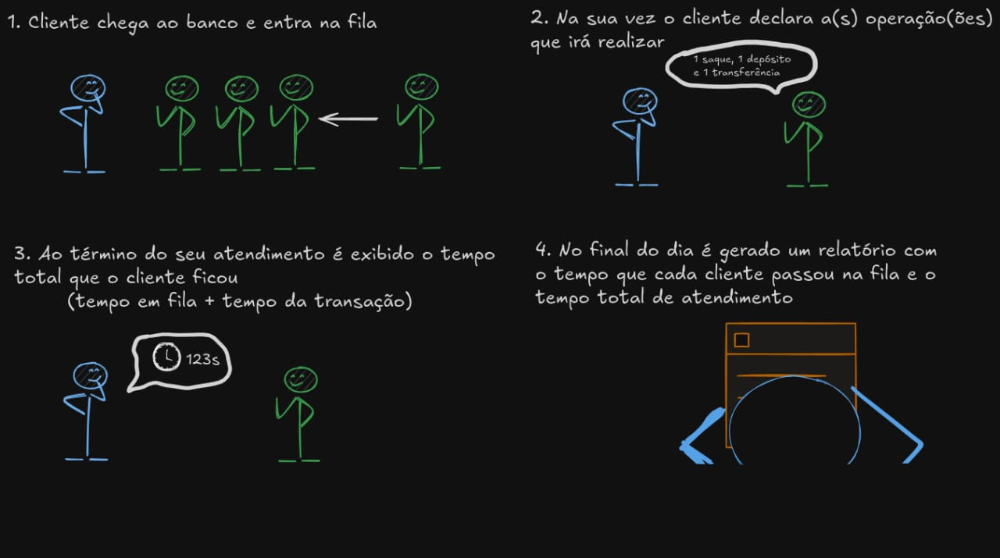

# Estrutura de dados - Atividade 2

## Integrantes da equipe

- Carlos Eduardo Pinheiro Silva
- Leonardo Ferreira de Brito

## Descrição do Problema

O projeto tem como o objetivo ser uma resolução de um problema proposto utilizando estruturas de dados em C e avaliando boas práticas de programação, corretude e eficiência do código.

A situação escolhida pela equipe foi a situação 3 onde possuimos a seguinte descrição:

**Situação 3:** simulação de atendimento bancário. Além de fazer o gerenciamento da fila, o sistema deve
exibir o tempo que o cliente permaneceu na fila. Quando o cliente entra na fila o tempo é registrado
para ser adicionado no tempo final que ele ficou. O cliente pode fazer uma ou várias das transações
abaixo:

>| Código | Transação     | Duração |
>|--------|---------------|---------|
>| 1      | Saque         | 50s     |
>| 2      | Depósito      | 70s     |
>| 3      | Pagamento     | 100s    |
>| 4      | Transferência | 60s     |

No final do expediente, há um relatório que a gerência analisa sobre o atendimento, como quantidade
de clientes, tempo total, tempo de cada cliente, atendimento por prioridade, etc.

## Descrição da Solução

A solução será desenvolvida visando o atendente do banco como cliente final, já que ao final do atendimento com os clientes o cálculo de tempo resultará em um relatório descrevendo como foi o atendimento no dia, portanto o fluxo será o seguinte.


 

 Portanto o atendente poderá realizar 4 ações:

  1. **Adicionar cliente a fila** (o cliente receberá um número de acordo com a ordem de atendimento)
  2. **Visualizar a fila**
  3. **Atender o cliente a frente da fila**
  4. **Terminar os atendimentos e visualizar o relatório**

Ao final do dia o atendente possuirá um relatório sobre o tempo de atendimento para podendo medir o desempenho do atendimento e podendo levar isso em consideração para tomada de decisões no futuro.

## Como iniciar o programa

> Garanta que você possui o `gcc` instalado e que pode executar códigos sh no terminal.

No terminal:

1. Rode o script de compilação

    ```
    source ./compile.sh
    ```
2. Inicie o programa com:

    ```
    ./main
    ```
